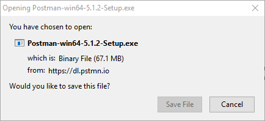
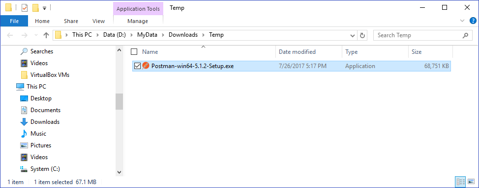
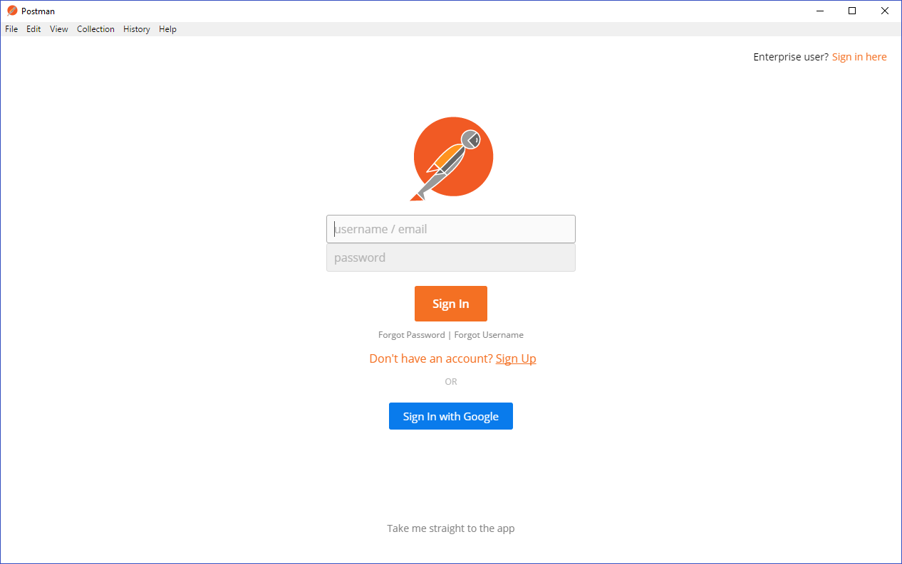

 

Update: August 16, 2017

# APIPCS / ICS Integration Workshop Prerequisites

## Required 3rd Party Testing Tools

### Install Postman Chrome Plugin

We will use the Postman Chrome Browser Plugin to test an ICS REST Web Service integration.
If you don't already have the Postman Chrome Plugin installed on your workstation, you'll need to install it.

To install Postman for testing API and ICS integration, follow these instructions:

- Download Postman Native Apps for your laptop platform from the following URL:

<https://www.getpostman.com/apps>

- Save the download file to a temporary directory on your workstation.

- Run the installer from the temporary directory

- Postman will start when the installation is completed

- If you get the Postman UI above, select “Take me straight to the app” link

- Refer to this link for more information on Postman installation: 

<https://www.getpostman.com/docs/postman/launching_postman/installation_and_updates> 

---

## Supported Browsers

Most modern browsers including Chrome, Safari, Internet Explorer, Edge and Firefox are supported.

