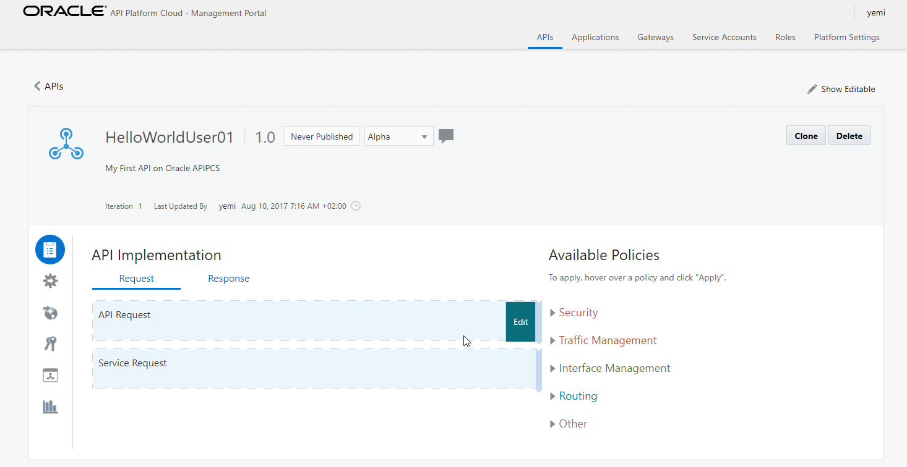
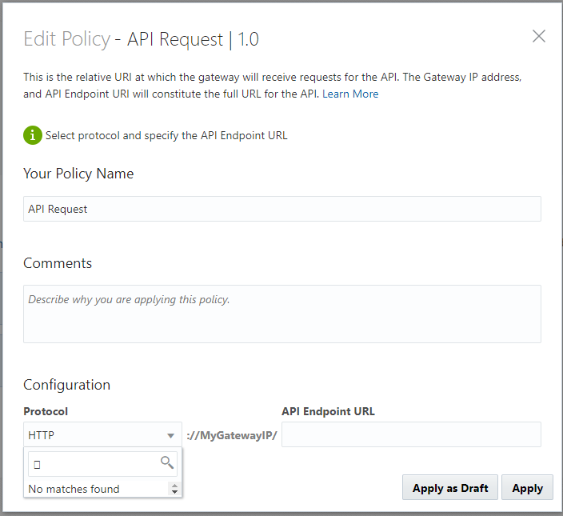
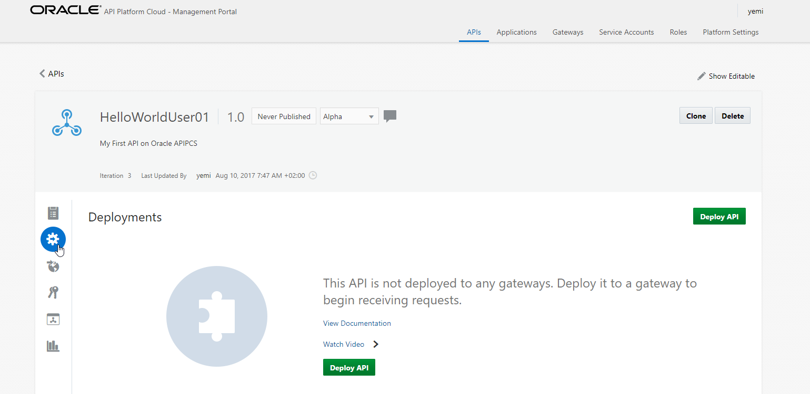
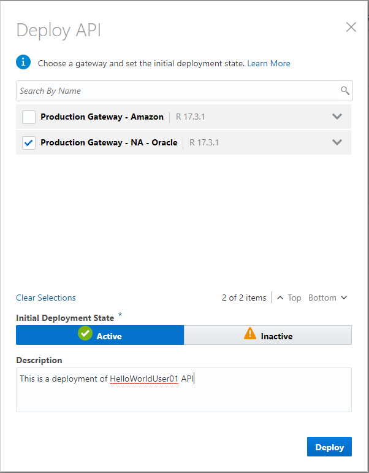
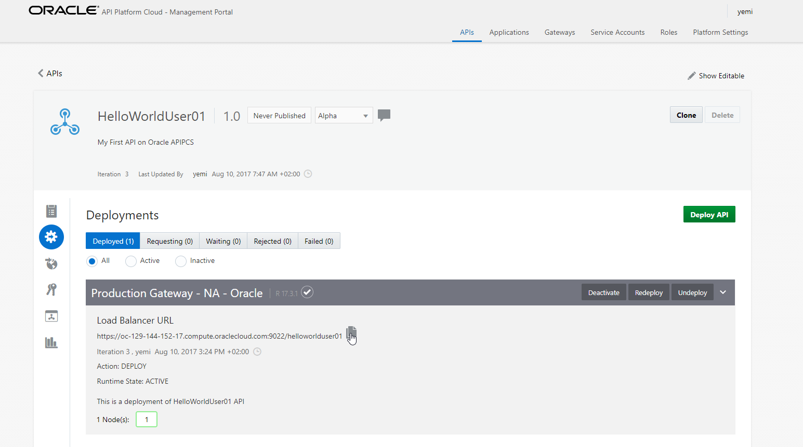
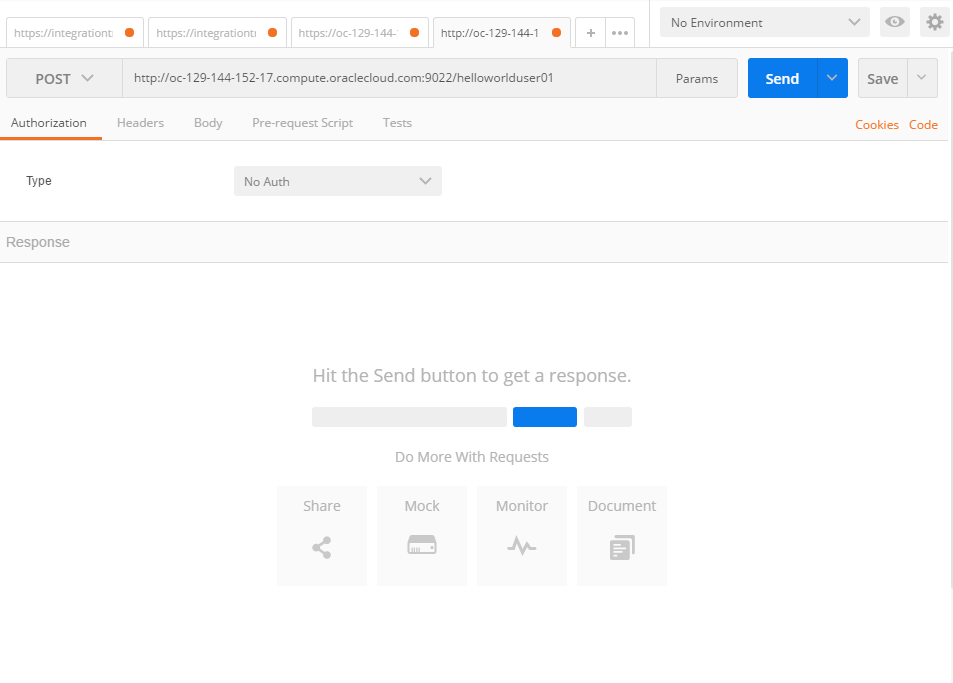
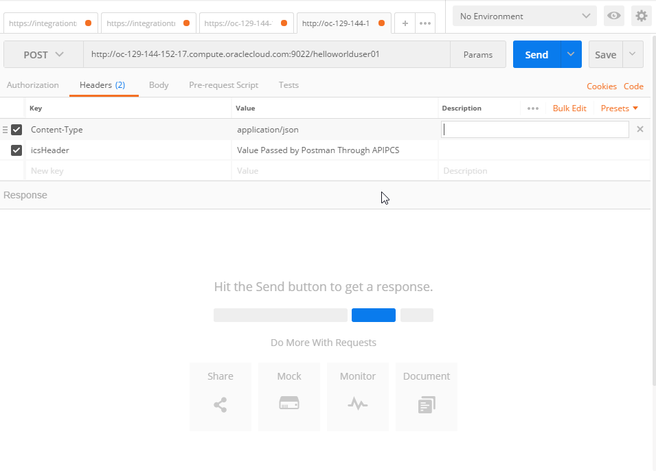
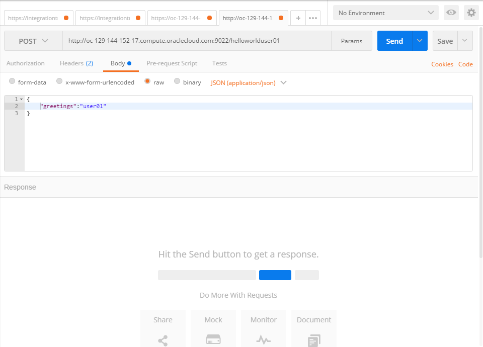

<center></center>

# Lab 200 - API Platfrom Cloud Service

## Objectives

- Using API Platform Cloud Service (APIPCS) to create an API, configure endpoint and credentials to connect to ICS HelloWorld API.

## Required Artifacts

- The following lab and an Oracle Public Cloud account that will be supplied by your instructor.
- Deployment of ICS REST service in Lab 100

## Introduction

This is the second of several labs that are part of the **APIPCS/ICS Development Workshop**.

In this lab, we will learn how to expose our ICS REST service, created in Lab 100, through the API Platform Cloud Service, enforce policies and share the documentation around our controlled service to developers.

We’ll look at the following:
1.  Creating an API
2.  Adding a Service Request with Service Account to the API
3.  Deploying the API to the Gateway
3.  Testing the API through the Gateway

## Creating the API in APIPCS


---
## 1. Login to APIPCS

---

### **1.1.1**: Login to the APIPCS Home Page

>***NOTE:*** the **User Name** and **Password** values will be given to you by your instructor. See _Lab 100 **1.1.1**: Login to your Oracle Cloud Account_ for more information on how to sign into the APIPCS home page.

The address should

It should read similar to:

APIPCS = api-manager-userXX

APIPCS Password = OracleiPa$$Us3rXX

**If your User Number is a single digit you will not have a 0 in first digit**

  

Sign in to the Management Portal as a user with the API Manager role:


### **1.1.2**: Configure the API Request

The API request is the endpoint to which requests for your API are sent when it is deployed to a gateway.

To configure the API Request:

**1.1.2.1** From the APIs page, click the API you created in the previous task.

**1.1.2.2** Hover over the API Request policy, and then click Edit.

   

>***NOTE:*** If the Apply Policy Dialog does not appear, disable any pop-up blockers that are active and try again.



**1.1.2.3** On the Apply Policy Dialog, complete these fields:

- Select HTTPS from the Protocol list. This is the protocol on which the gateway receives requests for this API.

- Enter name of your resource in lower case, followed by your assigned number to ensure uniqueness (like helloworlduserXX) into the API Endpoint URL field.


**1.1.2.4** Click Apply.

### **1.1.3**: Configure the Service Request

The service request is the URL at which your backend service receives requests. When a request meets all policy conditions, the gateway routes the request to this URL and calls your service.

The service request URL can point to any of your service’s resources, not just its base URL. This way you can restrict users to access only a subset of your API’s resources.

To configure the service request:

**1.1.3.1** Hover over the Service Request policy, and then click Edit.


**1.1.3.2** On the Apply Policy Dialog, complete these fields:

- Paste the mock server value you copied at the end of Lab 100 (which should resemble
  https://ICS URL/integration/flowapi/rest/HELLOWORLD_USER01/v01/helloworld_user01) into the Backend Service URL field.

- Add the Service Account which stores the credentials to log into Oracle ICS


**1.1.3.3** Click Apply.


**1.1.3.4** Click Save Changes

### **1.1.4**: Deploy API to the API Gateway

After creating the API, adding the API Request and Service Request. In this section you will deploy the API to an API Gateway so that it receives requests at the endpoint you configured and routes successful requests to the service you created with Oracle ICS in Lab 100.

To deploy the API:

**1.1.4.1** Click the Deployments tab.



**1.1.4.2** Click Deploy API. You will see a list of Deployment Gateways available with APIPCS


**1.1.4.3** Select the `Production Gateway - NA- Oracle` Gateway.

**1.1.4.4** Select Active as the Initial Deployment State.

**1.1.4.5** (Optional) Complete the description field in as you like.



**1.1.4.6** Click Deploy.

Wait for the deployment to complete (the page refreshes automatically). The deployment is complete when your API displays on the Deployed tab.


**1.1.4.7** Copy the URL that appears in the Load Balancer URL section. This is the endpoint clients use to send requests to your proxy API on the gateway.

**1.1.4.8** The URL should look something like this: https://oc-129-144-152-17.compute.oraclecloud.com:9022/helloworlduser01



**1.1.4.9** If the Copy Icon does not copy the URL to the Clipboad, go back to the main API Page and click on the Copy URL Icon


---

## 2. API Configuration

---

### **1.1.1**: Create an API Proxy

Now you’ll create a proxy for your API. To create an API:

**1.1.1.1** From the APIs tab, click Create API.

**1.1.1.2** Enter the name of your resource followed by your assigned number (like HelloWorldUserXX) into the API Name field. This makes it easier to identity your API in case multiple people use the same API name.

**1.1.1.3** Enter 1 in the Version field.

**1.1.1.4** (Optional) Populate the description field in this form as you would like.


**1.1.1.5** Click Create.


### **1.1.2**: Configure the API Request

The API request is the endpoint to which requests for your API are sent when it is deployed to a gateway.

To configure the API Request:

**1.1.2.1** From the APIs page, click the API you created in the previous task.

**1.1.2.2** Hover over the API Request policy, and then click Edit.

   

>***NOTE:*** If the Apply Policy Dialog does not appear, disable any pop-up blockers that are active and try again.


**1.1.2.3** On the Apply Policy Dialog, complete these fields:

- Select HTTPS from the Protocol list. This is the protocol on which the gateway receives requests for this API.

- Enter name of your resource in lower case, followed by your assigned number to ensure uniqueness (like helloworlduserXX) into the API Endpoint URL field.


**1.1.2.4** Click Apply.

### **1.1.3**: Configure the Service Request

The service request is the URL at which your backend service receives requests. When a request meets all policy conditions, the gateway routes the request to this URL and calls your service.

The service request URL can point to any of your service’s resources, not just its base URL. This way you can restrict users to access only a subset of your API’s resources.

To configure the service request:

**1.1.3.1** Hover over the Service Request policy, and then click Edit.


**1.1.3.2** On the Apply Policy Dialog, complete these fields:

- Paste the mock server value you copied at the end of Lab 100 (which should resemble
  https://ICS URL/integration/flowapi/rest/HELLOWORLD_USER01/v01/helloworld_user01) into the Backend Service URL field.

- Add the Service Account which stores the credentials to log into Oracle ICS


**1.1.3.3** Click Apply.


**1.1.3.4** Click Save Changes

### **1.1.4**: Deploy API to the API Gateway

After creating the API, adding the API Request and Service Request. In this section you will deploy the API to an API Gateway so that it receives requests at the endpoint you configured and routes successful requests to the service you created with Oracle ICS in Lab 100.

To deploy the API:

**1.1.4.1** Click the Deployments tab.


**1.1.4.2** Click Deploy API. You will see a list of Deployment Gateways available with APIPCS


**1.1.4.3** Select the `Production Gateway - NA- Oracle` Gateway.

**1.1.4.4** Select Active as the Initial Deployment State.

**1.1.4.5** (Optional) Complete the description field in as you like.


**1.1.4.6** Click Deploy.

Wait for the deployment to complete (the page refreshes automatically). The deployment is complete when your API displays on the Deployed tab.


**1.1.4.7** Copy the URL that appears in the Load Balancer URL section. This is the endpoint clients use to send requests to your proxy API on the gateway.

**1.1.4.8** The URL should look something like this: https://oc-129-144-152-17.compute.oraclecloud.com:9022/helloworlduser01


**1.1.4.9** If the Copy Icon does not copy the URL to the Clipboad, go back to the main API Page and click on the Copy URL Icon


### **1.1.5**: Test API

To test the `HelloWorld` integration, we will use `Postman` installed during the pre-requisite section. Postman will now call APIPCS for the API and if successful, send the request to ICS for processing

Click on the `+` menu option to open a new Tab


**1.1.5.1** On the `New Tab` page, enter the following information

**1.1.5.2** Change the `GET` to `POST`

- URL : https://oc-129-144-152-17.compute.oraclecloud.com:9022/helloworlduser01

>***NOTE:*** the URL is the Load Balancer URL when you deployed the service to API Gateway. Also, we are not adding authentication during this test because APIPCS is responsible for authenticating the request with ICS using Service Account Added when you configured the Service Request in Section 1.1.3



**1.1.5.3** Select `Headers` tab to add the following headers to the request

-Content-Type : application\json

-icsHeader : Value Passed by Postman Through APIPCS



**1.1.5.4** Select `Body` tab to add the request

**1.1.5.5** Select `raw` type

**1.1.5.6**Supply the following JSON:

```javascript
{
    "greetings":"user01"
}
```



**1.1.5.7** Click `Send` to test HelloWorld API


**1.1.5.8** Check that `icsHeader` is also populated by selecting `Headers`, then scroll to the bottom of the screen


You are now completed with Lab 200.

In the next lab, we'll look at adding additional policies to the API.

## Completion of LAB 200
