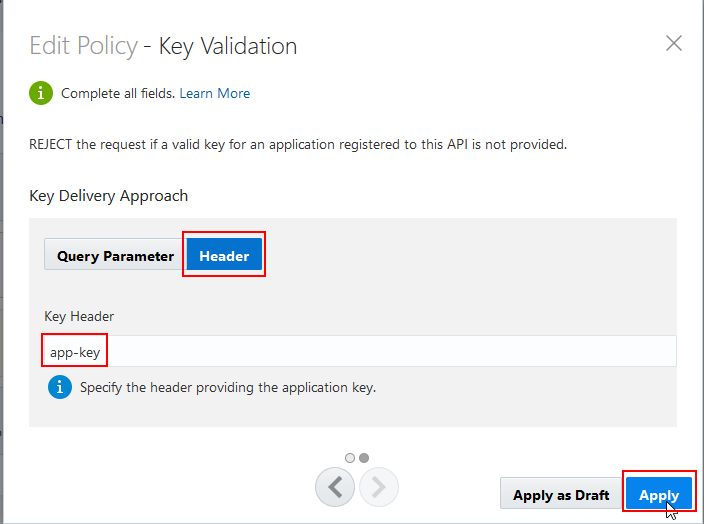

# Lab 300 - API Platform Cloud Service

## Objectives

- Using API Platform Cloud Service (APIPCS) to add Policies to manage, secure and govern the HelloWorld API.

## Required Artifacts

- The following lab and an Oracle Public Cloud account that will be supplied by your instructor.
- Deployment of ICS REST service in Lab 100
- Completion of the API setup and deployment in Lab 200

## Introduction

This is the thrid of several labs that are part of the **APIPCS/ICS Development Workshop**. 

In this lab, we will learn how to apply policies to the API created in Lab 200, through the API Platform Cloud Service.

We’ll look at the following:
1.  Apply Policies to API
2.  Re-Publish API to gateway
3.  Test Applied Policies

## Login to your Oracle Cloud account

### Login to APIPCS Home Page

>***NOTE:*** the **User Name** and **Password** values will be given to you by your instructor. See _Lab 100 **1.1.1**: Login to your Oracle Cloud Account_ for more information on how to sign into the APIPCS home page.

  

Sign in to the Management Portal as a user with the `API Manager` role:

 

---

## 1. API Platform Cloud - API Policies

---

### 1.1 Add a Key Validation Policy

------

In this part of the lab, you’ll add a validation policy to your API to ensure that Application Developers consuming it have registered it to an application, the application is registered, and a current, valid application key is used.

To configure the key validation policy:

**1.1.1**	Back in the Management Portal, click the API Implementation tab.

**1.1.2**	In the `Available Policies` section, expand `Security`, hover over `Key Validation`, and then click `Apply`.

**1.1.3**	On the Apply Policy Dialog, complete these fields:

**1.1.3.1** (Optional) Complete the name and description fields as you would like.

**1.1.3.2** Ensure that `API Request` is selected from the Place Policy After list, and then click Next.

**1.1.3.3** Click the Header tab.

**1.1.3.4** Enter the text `app-key` into the Header field. The application key must be sent in a header named `app-key` for the request to be passed to the next policy or to the service request endpoint.

**1.1.3.5** Click `Apply`.

**1.1.4**	Note that the new "Key Validation" policy will show up in the `Request` pipeline.

**1.1.5** Click the `Save Changes` button.

### 1.2 Add an Application Rate Limiting policy

------

Follow this task to add an application rate limiting policy. Application rate limiting policies are used to control how many requests are routed to an API from each application during a given period. If this threshold is exceeded, the gateway rejects subsequent requests from that application during this period.

To configure the application rate limiting policy:

**1.2.1**	(Optional) If necessary, sign back in to the API Platform Cloud Service Management Portal as your API Manager user.

**1.2.2**	(Optional) If necessary, On the APIs page, click your API to open its details page.

**1.2.3**	(Optional) If necessary, Click the Implementation tab.

**1.2.4**	In the Available Policies section, collapse `Security` (if it's still expanded), then expand the `Traffic Management` policies.

**1.2.5** Hover over `Application Rate Limiting`, and then click `Apply`.

Note: Make sure you’ve added the `Application Rate Limiting` policy, not the `API Rate Limit` policy. These policies behave differently; if you use the wrong one you may experience results different than those described in this document.

**1.2.6** On the Apply Policy Dialog, complete these fields:

**1.2.6.1** (Optional) Complete the name and description fields as you would like.

**1.2.6.2** Ensure that `Key Validation` is selected from the `Place Policy After` list.

**1.2.6.3** Click `Next`.

**1.2.6.4** Enter a number between `1` and `10` into the `Rate Limit Per Application` field. This is the number of requests that will be passed during each time interval.

**1.2.6.5** Select `Minute` from the `Time Interval` list.

You can add additional conditions. This is useful if you want to limit the number 

**1.2.7**	Note that the new "Application Rate Limiting" policy will show up in the `Request` pipeline.

**1.2.8** Click the `Save Changes` button.

### 1.3 Re-Deploy API to the API Gateway

------

After adding policies to the API, we will now re-deploy the API to API Gateway so that it can enforce them as it receives requests at the endpoint you configured in Lab 200. 

To re-deploy the API:

**1.3.1** Click the Deployments tab.

**1.3.2** Click on the header of the `Production Gateway - NA - Oracle` gateway and you will see a set of 3 buttons: `Deactivate`, `Redeploy`, and `Undeploy`.

**1.3.3** Click on the `Redeploy` button, then the `Latest Iteration` button that will appear.

**1.3.3** You will prompted at the top that you are sure you want to redeploy.  Optionally enter a comment, then select the `Yes` button.

**1.3.4** The `Redeploy Request` message will be seen, then the request is put in the `Waiting` state until the API Gateway polls the API Management Console for the change.

**1.3.5** After waiting for the API Gateway to poll the API Management Server, the API Deployment will be promoted to the `Deployed` state again.

Note: The comment you added when redeploying will be shown in the comment section of the API deployment details.  Here, the `Adding Policies` comment is shown.

**1.3.6** As was done in Lab 200, copy the URL that appears in the Load Balancer URL section. This is the endpoint clients use to send requests to your proxy API on the gateway. 

**1.3.7** The URL should look something like this: http://oc-129-144-152-17.compute.oraclecloud.com:9022/helloworlduser10

### 1.4 Initial Re-Test of the API with Policies

------

**1.4.1** (Pre-Req) Follow the steps in Lab 200, section 1.1.5 again to setup the Postman API Test.  This should still be setup in your Postman instance unless it was closed.

**1.4.1** Select the `Send` button again in Postman to query the API.

Note that the API will not work anymore because there is no application key passed in the header.  The `Key Validation` policy enforcement returned a `401 Unauthorized` error.

**1.4.2** What we need to do now is get an `API Key`.  The API Key is obtained by registering an `Application` against our API.  The next section will step you through the Application setup and registration against the API.

### 1.5 Application Creation and Registration

------

One of the requirements for your API is that all calling applications be registered in order to be able to call the API.  The calling application has to be registered to the API and will have to pass the appropriate identifying header value.  With this requirement, in order to test your API, you will register it to the TestApp.

To register an application:

**1.5.1** Click the Registrations tab.

**1.5.2** Click Register Application.

**1.5.3** Click on the `Create an application` link at the top of the `Register Application` dialog:

**1.5.4** Enter a new application using the naming convention `TestAppXX` where `XX` is your assigned user number for the workshop.

**1.5.5** Click on the `Register` button to create the application and register the API to it.

Note: Normally you would fill out the `Type`, `Description`, and `Contact` fields for the application - we're skipping just for the sake of saving time in this lab.

**1.5.5** Back on the `Registrations` tab for the API, you'l be able to see your new application `TestAppXX`.

**1.5.6** Now we need to go get our API Key that was created with the new application.  Click on the `Applications` tab in the upper right of your screen.

**1.5.7** Click on your new application `TestAppXX` to see the details.

**1.5.8** Note that the `App Key` is shown on the detail screen.  There is a little `Copy to Clipboard` icon present next to the app key.  click on this icon to copy the app key so we can use it to re-test in Postman.

**1.5.9** On some browsers, the `Copy to Clipboard` doesn't work properly.  If that is the case, you can simply click on the App Key and then copy to your clipboard with a <ctrl> + `C` 

### 1.6 Final Re-Test of the API with Policies

------

**1.6.1** Add the `api-key` header to the Postman request using the `App Key` that was copied in the last step from the APIPCS `Applications` tab.

**1.5.11** Note that the status of `200` should now be received by the API request.

**1.5.12** Next, select the `Send` button enough times in order to exceed your `Rate Limiting` API policy that was added.  Once that policy is exceeded, you will receive a `403 Forbidden` status response for the API call on Postman.

You are now completed with Lab 300.

In the next lab, we'll look at analytics in the API Platform Cloud Service.

## Completion of LAB 300
