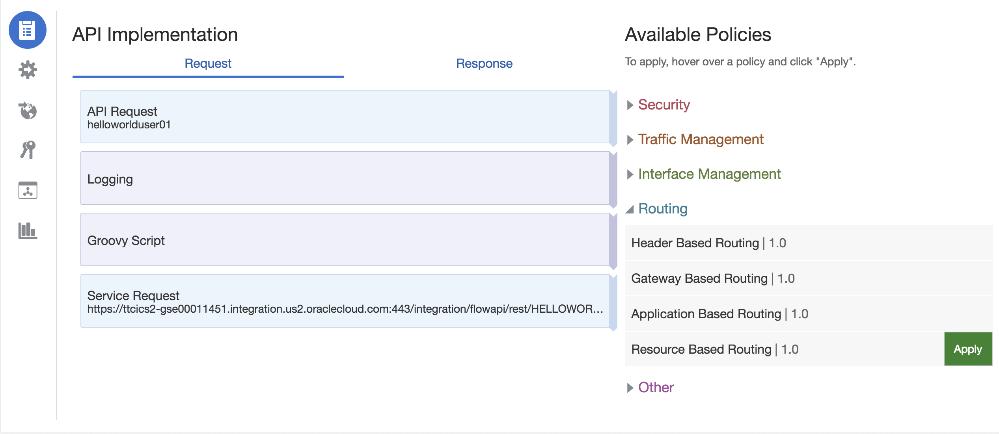
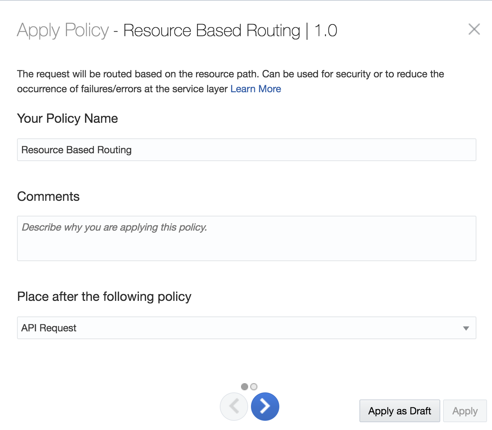
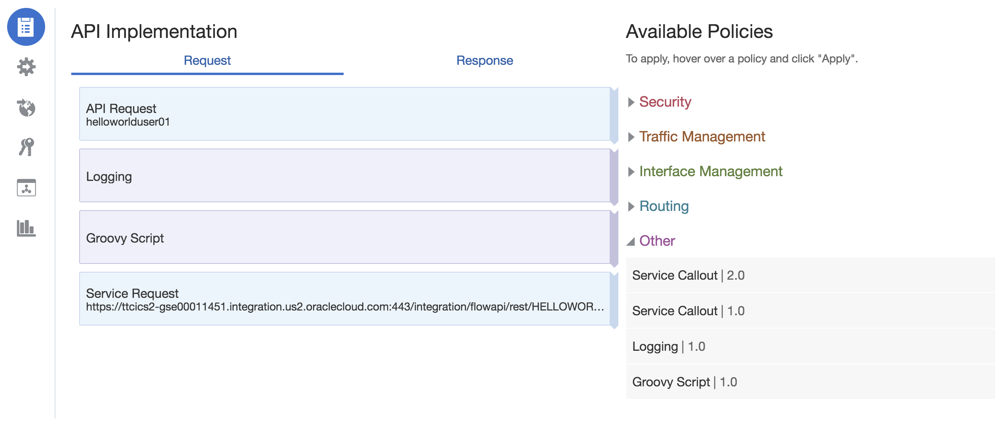
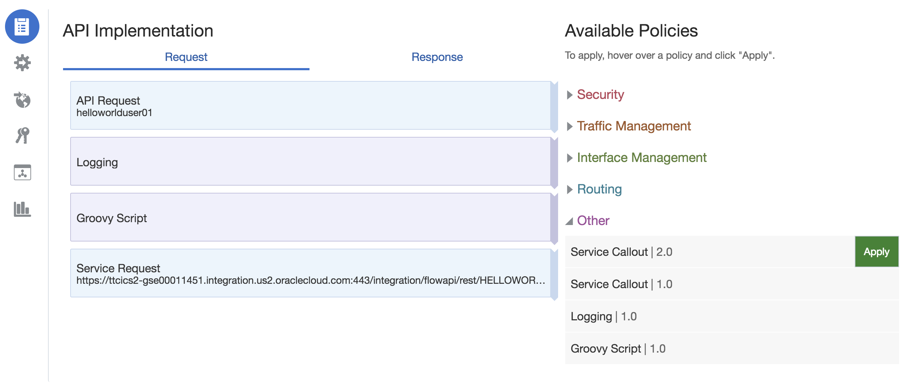
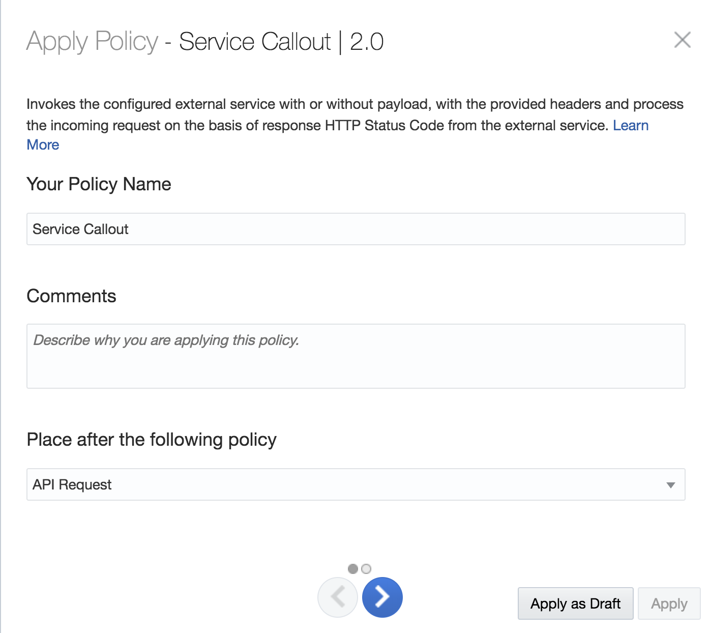
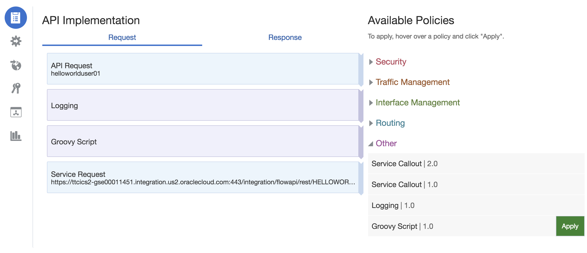
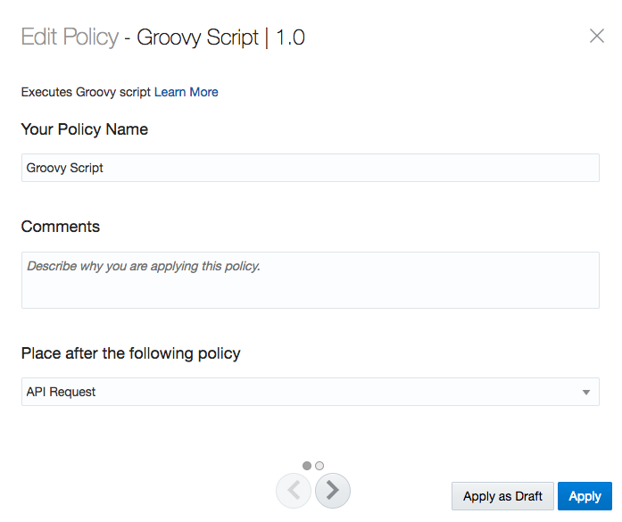
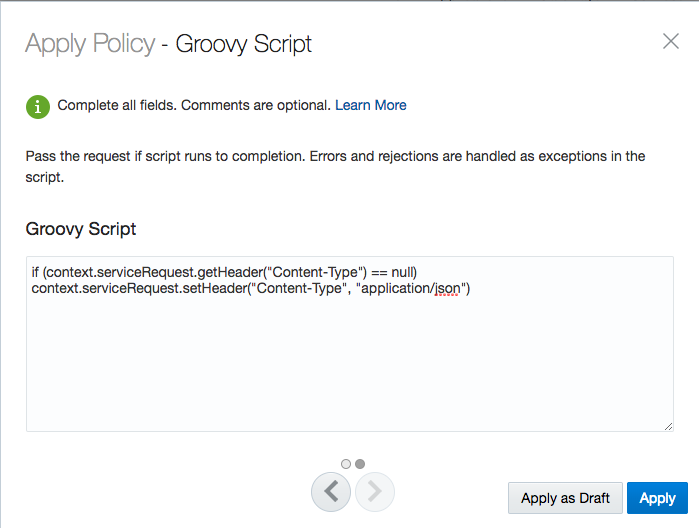
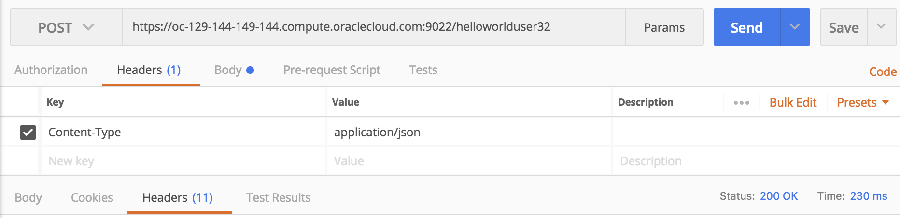
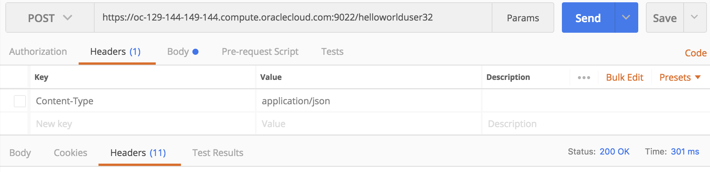

# Lab 400 - Adding Additional Policies

---

## Objectives

- Using API Platform Cloud Service to view Analytics of API's

## Required Artifacts

- The following lab and an Oracle Public Cloud account that will be supplied by your instructor.

## Introduction

In this Lab you’ll view five of the charts available to API Managers.

## 1.1: Header Validation

### **1.1.1**: Adding the Header Validation

---

-Head back to your dashboard to view the home screen.

-Under the Available Policies tab you will see the `Interface Management` Section. Now click to expand the `Header Validation` Section.

-Now click the **Apply** button when you select the `Header Validation` Section

-You will now see the `Header Validation` policy in the Requests section of the API Implementation. Click the **Edit** button to bring up the menu.

### **1.1.2**: Applying Reject Header Validation

---

-After clicking the **Edit** in the previous step, the following prompt should show up for you.

-In the drop down select the `Reject` and `Any`. Also in the lower sections fill in the field with `policyreject`, `!=` in the dropdown, and `helloworldreject`. You may use any name you wish for the fields, just be sure to remember them.

### **1.1.3**: Testing the Reject Header Validation

---

-Navigate back to the Postman Application.

-As we have done in the previous sections, we will be appending the Headers in our request.

-Now we will be adding a key with the value of `policyreject` and a value of `anyotherheader` and then send the request.

-You will notice that it will give you a "400 Bad Request" error in the bottom right section of your screen. This is due to our settings in the previous section. Since the `policyreject` key does not have a value of `helloworldreject`, the response will be rejected.

-Now we will change the value of the key from `helloworldreject` to `helloworldreject` and send the request again.

-The response is now "200" again. This is because we have set our policy to reject any that isn't `helloworldreject` and now our responses are passing the rule.

### **1.1.4**: Applying Pass Header Validation

---
-Navigate back to the dashboard as you have done in previous steps.

-Now click the **Edit** in the `Header Validation` Request as we have done in the previous steps, the following prompt should show up for you.

-In the drop down select the `Pass` and `Any`. Also in the lower sections fill in the field with `policypass`, `=` in the dropdown, and `helloworldpass`. You may use any name you wish for the fields, just be sure to remember them.

### **1.1.5**: Testing the Reject Header Validation

---

-Navigate back to the Postman Application.

-As we have done in the previous sections, we will be appending the Headers in our request.

-Now we will be adding a key with the value of `policypass` and a value of `anyotherheader` and then send the request.

-You will notice that it will give you a "400 Bad Request" error in the bottom right section of your screen. This is due to our settings in the previous section. Since the `policyreject` key does not have a value of `helloworldpass`, the response will be rejected.

-Now we will change the value of the key from `anyotherheader` to `helloworldpass` and send the request again.

-The response is now "200" again. This is because we have set our policy to reject any that isn't `anyotherheader` and now our responses are passing the rule.

## 1.2: Interface Filtering

### **1.2.1**: Adding the Interface Filtering

---

-Head back to your dashboard to view the home screen.

-Under the Available Policies tab you will see the `Interface Management` Section. Now click to expand the `Interface Management` Section.

-Now click the **Apply** button when you select the `Interface Filtering` Section

-You will now see the `Interface Filtering` policy in the Requests section of the API Implementation. Click the **Edit** button to bring up the menu.

### **1.1.2**: Applying the Interface Filtering

---

-After selecting Interface filtering and clicking the **Edit**, the following prompt should show up for you.

-In the drop down select the `Reject` and `ALL` from the Methods Dropdown. In the resources enter `/hello/world`, to use for this example.

-Once this has been completed, save the changes and then redeploy the API again.

### **1.1.3**: Testing the the Interface Filtering

---

-Navigate back to the Postman Application.

-This time we will be appending the POST address. It should be similar to `https://oc-129-144-150-133.compute.oraclecloud.com:9022/helloworlduser01/hello/world`. The same POST address that we have been using previously, with the `/hello/world` that we created in the previous step.

-If the previous steps were done correctly it should show a status of `405 Method Not Allowed`, rather than 200 or 404 Error. This is a result of the interface filtering rejecting the resource you have set. Now if you remove the `/hello/world` from the end of URL, the response should be a 200 again.

## 1.3: Resource Based Routing

### **1.1.1**: Adding the Resource Based Routing

---

-Head back to your dashboard to view the home screen.

-Under the Available Policies tab you will see the `Routing` Section. Now click to expand the `Resource Based Routing` Section.

-Now click the **Apply** button when you select the `Resource Based Routing` Section

-You will now see the follow prompt pop up after selecting apply.

### **1.1.2**: Applying Reject Header Validation

---

-After clicking the **Edit** in the previous step, the following prompt should show up for you.

-In the drop down select the `Reject` and `Any`. Also in the lower sections fill in the field with `policyreject`, `!=` in the dropdown, and `helloworldreject`. You may use any name you wish for the fields, just be sure to remember them.

## 1.4: Service Callout

### **1.1.1**: Adding the Service Callout

---

-Head back to your dashboard to view the home screen.

-Under the Available Policies tab you will see the `Other` Section. Now click to expand the `Service Callout` Section.

-Now click the **Apply** button when you select the `Service Callout 2.0` Section

-You will now see the follow prompt pop up after selecting apply.

### **1.1.2**: Applying Reject Header Validation

---

-After clicking the **Edit** in the previous step, the following prompt should show up for you.

-In the drop down select the `Reject` and `Any`. Also in the lower sections fill in the field with `policyreject`, `!=` in the dropdown, and `helloworldreject`. You may use any name you wish for the fields, just be sure to remember them.

## 1.5: Groovy Script

### **1.1.1**: Adding the Groovy Scripting

---

-Head back to your dashboard to view the home screen.

-Under the Available Policies tab you will see the `Other` Section. Now click to expand the `Groovy Script` Section.

-Now click the **Apply** button when you select the `Groovy Script` Section

-You will now see the follow prompt pop up after selecting apply.

### **1.1.2**: Setting the Groovy Script

---

-After clicking the **Apply** in the previous step, the following prompt should show up for you.

-In the prompt you can name it anything, but you can leave it as `Groovy Script`. In the `Place after the following policy` section, select `API Request` from the drop down as this will use the Groovy Script after the API Request that we will send in Post Man.

UPDATE THIS PHOTO

Click on the arrow to navigate to the next menu.

- In the field enter
`if (context.serviceRequest.getHeader("Content-Type") == null) context.serviceRequest.setHeader("Content-Type", "application/json")`
and then select apply.

- After this is done then redeploy the API.

### **1.1.3**: Testing the Groovy Script with Post Man

---

-Navigate back to the Postman Application.

-As we have done in the previous sections, we will be appending the Headers in our request.

-You will see the `Content-Type` field and a value of `application/json`. For the moment leave it checked and then a request in order to check for a response.

-If it is a "200 OK" response then we will move onto the next step.

-Now remove this header from the Post Man application. You can either remove it entirely or just unselect the check from the left of the `Content-Type`.

-Send a request and it should still send back a "200 OK." This is because the Groovy Script is automatically adding the `Content-Type: application/json` to the response.

-Using Groovy Script in such a manner is a great way for developers to resolve and decrease the amount of errors involving the APIPCS service as it creates safeguards for your API.

## Completion of LAB 400
