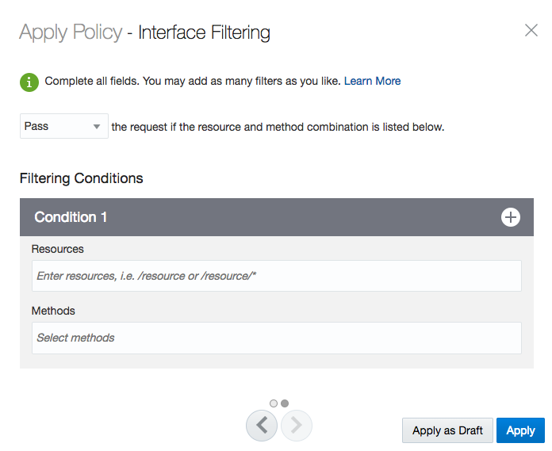

# Lab 400 - Adding Additional Policies

---

## Objectives

- Using API Platform Cloud Service to view Analytics of API's

## Required Artifacts

- The following lab and an Oracle Public Cloud account that will be supplied by your instructor.

## Introduction

In this Lab you’ll view five of the charts available to API Managers.

## 1.1: Header Validation

### **1.1.1**: Adding the Header Validation

---

-Head back to your dashboard to view the home screen.

-Under the Available Policies tab you will see the `Interface Management` Section. Now click to expand the `Header Validation` Section.

-Now click the **Apply** button when you select the `Header Validation` Section

-You will now see the `Header Validation` policy in the Requests section of the API Implementation. Click the **Edit** button to bring up the menu.

### **1.1.2**: Applying Reject Header Validation

---

-After clicking the **Edit** in the previous step, the following prompt should show up for you.

-In the drop down select the `Reject` and `Any`. Also in the lower sections fill in the field with `policyreject`, `!=` in the dropdown, and `helloworldreject`. You may use any name you wish for the fields, just be sure to remember them.

### **1.1.3**: Testing the Reject Header Validation

---

-Navigate back to the Postman Application.

-As we have done in the previous sections, we will be appending the Headers in our request.

-Now we will be adding a key with the value of `policyreject` and a value of `anyotherheader` and then send the request.

-You will notice that it will give you a "400 Bad Request" error in the bottom right section of your screen. This is due to our settings in the previous section. Since the `policyreject` key does not have a value of `helloworldreject`, the response will be rejected.

-Now we will change the value of the key from `helloworldreject` to `helloworldreject` and send the request again.

-The response is now "200" again. This is because we have set our policy to reject any that isn't `helloworldreject` and now our responses are passing the rule.

### **1.1.4**: Applying Pass Header Validation

---

-The Payload Size chart displays the size of the payloads sent with each request. You can filter this chart to display the size of request or response payloads.

-You didn’t send any requests with response payloads; click `Response` to view the size of response payloads sent from the backend services.

### **1.1.5**: Requests by Resource Chart

---

-The Requests by Resource chart, at the bottom of the General page, displays the number and distribution of requests to your service’s resources. For each resource, this chart displays:

- The total number of requests to each resource
- The percentage (of total requests) of requests to each resource
- The total number of policy rejections for requests to each resource
- The percentage (of total rejections) of rejected requests to each resource
- The total number of service errors for requests to each resource
- The percentage (of total errors) of errored requests to each resource

### **1.1.6**: Requests by Application Chart

---

-Click the `Applications` page to view the Requests by Application chart.

-The Requests by Application chart displays the number and distribution of requests from each application, identified by the app key passed with each request. This chart displays two entries: one for the application you created in the lab, and another for the Customer Mobile App you registered to your API. For each resource, this chart displays:

- The total number of requests from each application
- The percentage (of total requests) of requests from each application
- The total number of policy rejections for requests from each application
- The percentage (of total rejections) of rejected requests from each application
- The total number of service errors for requests from each application
- The percentage (of total errors) of errored requests from each application

-You should not have received any errors; these columns in the table should be blank. If you sent requests from other applications, an entry for each application also appears here.

### **1.1.7**: Rejection Rate Chart

---

-Click the `Errors and Rejections` page to view the Rejection Rate chart.

-The Rejection Rate chart displays the number of requests to your API rejected by policy conditions.

-You can filter this chart to display all rejections, rejections from policies in the request flow, rejections from policies in the response flow, and rejections from the backend service. You can also filter the chart to display only rejections from specific policy types. Select `Header Validation` from the `Select a policy` list. This displays only rejections by the header validation policy.

### **1.1.8**: Rejection Distribution Chart

---

- The Rejection Distribution chart displays the number and distribution of rejections of your requests.

-You can filter this chart to display all rejections, rejections from policies in the request flow, rejections from policies in the response flow, and rejections from the backend service. Select `Show Policy Types` to show the number of rejections for each policy type; select `Show Policy Instances` to show rejections from each instance of a policy. For example, if you have multiple header validation policies, selecting Show Policy Types displays all header validation policy rejections as a single data point. If you select Show Policy Instances, rejections from each of the header validation policies are displayed as separate data points.

### **1.1.9**: Other Analytics Charts

---

-These charts are also available in API Platform Cloud Service:

- Error Rate: Displays number of occurrences and percent of total errors over time, per API. You can filter this chart to display all errors, policy errors, service errors, or a specific error. API and Gateway Managers can use this to see how many errors have occurred and the ratio of errored requests to total request volume.
- Error Distribution: Displays the number of occurrences and percent of total errors, per API. You can filter this chart to display all errors, policy errors, or service errors. API and Gateway Managers can use this to see the frequency at which each error occurs

### **1.1.10**: Gateway Analytics

---

-In Oracle APIPCS, you can view Gateway Analytics Charts. In the current release of APIPCS, they are the same as those available on the API Analytics tab. The difference is that the data displayed on the Gateway Analytics tab represents all APIs deployed to a gateway (unless you apply filters); the data displayed on the API Analytics tab represents only the selected API.

-To view analytics for all APIs deployed to a gateway:

-Click the `Gateways` tab.

-Select API `Gateway` available from the list.

-Click the `Analytics` icon.

-Oracle APIPCS will display a summary of the API calls processed by the Gateway.

## Completion of LAB 400
