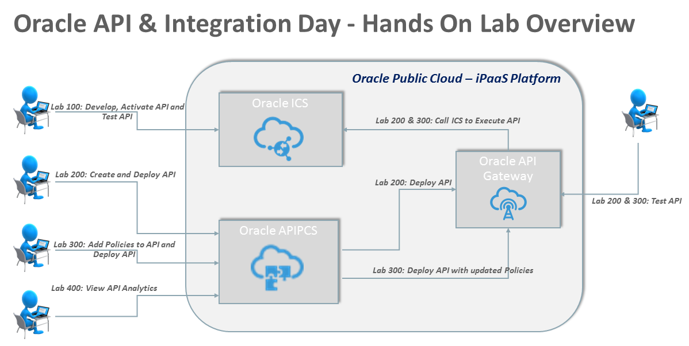

 
> Updated: August 15th, 2017

# Cloud Accelerate: Oracle API & Integration Day - Hands On Lab
A hands-on workshop to dive into development on Oracle's Cloud API and Integration Platforms

## Overview
Times are changing and things are getting simpler in the Cloud! At Oracle we have invested in delivering a plethora of new Cloud Services and we want to show you how simple – yet powerful they are. We specifically wanted to focus on low code, high productivity services that can be used in building enterprise grade solutions. We believe the best way to do this is to showcase a real world business solution comprised of these services. You will build the entire solution during the course of this workshop all in a stress-free fun environment. 

This workshop will focus on the Oracle API Platform Cloud Service (APIPCS) and Integration Cloud Service (ICS).  By the end of this workshop you would have created a complete API Platform solution.  The solution will leverage APIs created in Integration Cloud Service (ICS). No expertise or experience required We will have experienced instructors guide you through the tool’s online screens and explain how each service works. There is no expertise required from your side, just bring a laptop with a modern web browser.

## About APIPCS: 
The Oracle API Platform Cloud Service is a great API Management solution which supports agile API development, and also makes it easy to keep an eye on KPIs covering every aspect of the API lifecycle. True hybrid API deployment – in the Cloud or on-premises – means that your API solution is modern and adaptable, all while employing the most up-to-date security protocols.

## About ICS: 
Oracle ICS delivers best in class “Hybrid” Integration. ICS is a simple and powerful integration platform in the cloud to maximize the value of your investments in SaaS and on-premises applications. It includes an intuitive web based integration designer for point and click integration between applications and a rich monitoring dashboard that provides real-time insight into the transactions, all running on a mature runtime platform on Oracle Public Cloud. ICS will help accelerate integration projects and significantly shorten the time-to-market through it's intuitive and simplified designer, an intelligent data mapper, and a library of adapters to connect to various applications.

## Hands-on Lab Overview
This hands-on lab will allow participants to do the following:
- Create a Simple API using Oracle Integration Cloud Service
- Add the Simple API from Oracle ICS into APIPCS
- Add Policies to the API using APIPCS
- Test added Policies using Postman Client Software

## Get Started: 
Open the navigation menu using the hamburger icon in the upper left of the menu bar to choose a lab guide and get started.

The hamburger menu has an icon that looks like this: 

